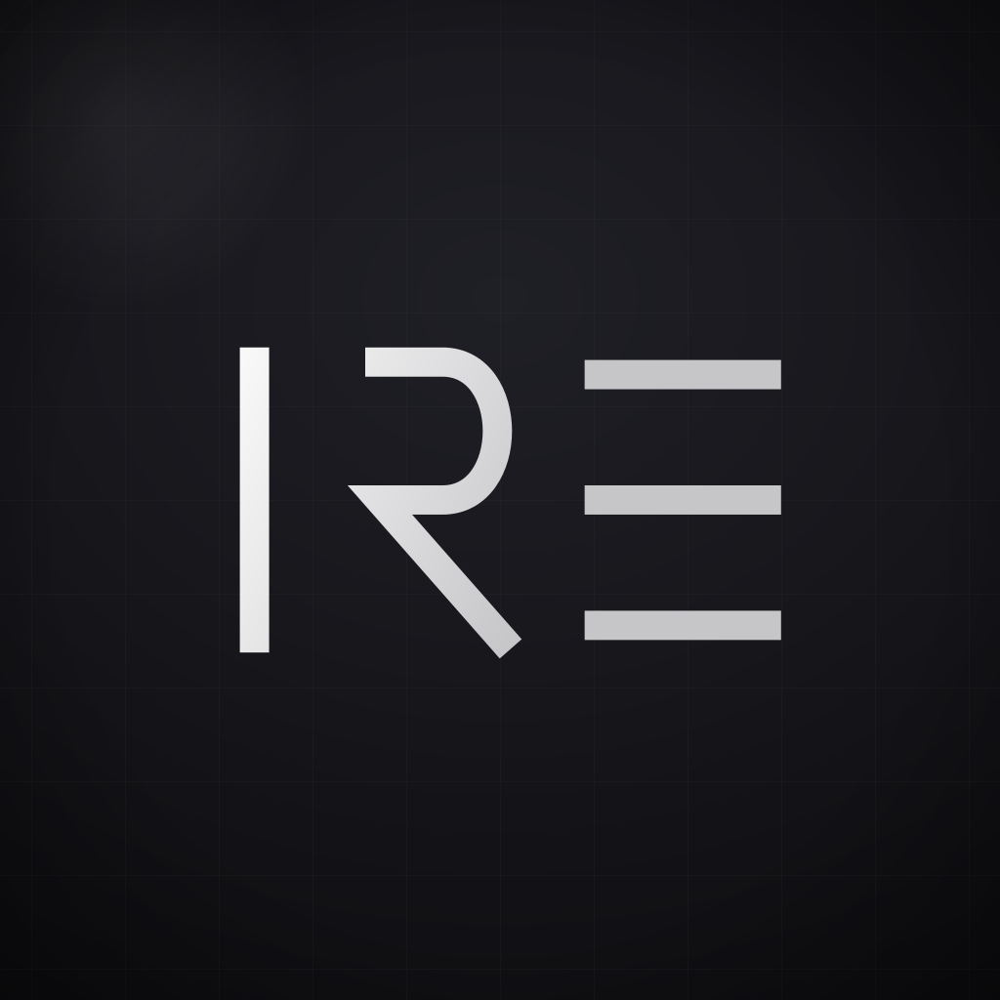
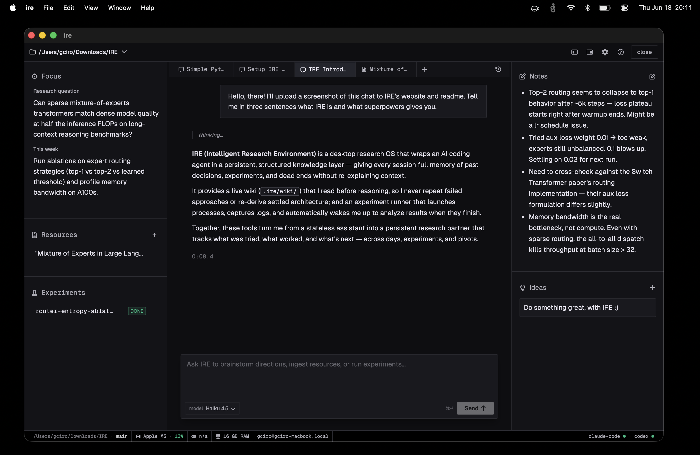

<p align="left">
  <a href="https://github.com/giacomo-ciro/ire/releases/latest"></a>
  <a href="https://ire-research.com"></a>
  <a href="LICENSE"></a>
  <a href="https://github.com/giacomo-ciro/ire/releases/latest"></a>
</p>

<p align="center">
  
</p>

# Integrated Research Environment (IRE)

> A local-first desktop environment for researchers. Keep your code, literature, experiments, and AI collaboration seamlessly connected.



## The Problem

ML research workflows are fragmented. You lose context between sessions, AI suggestions repeat dead ends because nothing remembers what failed, long experiments finish unnoticed, and the core research question drifts out of sight.

## Features

- **Persistent LLM Wiki** — A Git-tracked markdown wiki maintained automatically. Decisions, failed approaches, and blockers are injected into the agent's context so it never forgets.
- **Non-blocking Experiments** — Fire off a long-running experiment and keep working. When it finishes, the agent wakes up with full results and context, ready to continue.
- **Agentic IDE, Deeply Integrated** — AI agents can read your wiki, write findings, record memory, update your research pulse, and start experiments via a native MCP bridge.
- **Structured Memory** — Long-term memory for durable insights alongside short-term daily notes, automatically injected into context.
- **Your Research Stays Yours** — Nothing leaves your device except what you send to your AI provider. Git is your backup and collaboration layer.
- **One Workspace, One Repo** — Each workspace maps 1:1 to a Git repository. Code, wiki, experiment logs, and AI state all live together in `.ire/`.

## Quick Start

Grab the latest build from the [**Releases**](https://github.com/giacomo-ciro/ire/releases/latest) page:

| Platform | File |
|----------|------|
| macOS | `.dmg` |
| Linux | `.AppImage` / `.deb` / `.rpm` |
| Windows | _coming soon_ |

> The builds are not yet code-signed. On **macOS**, right-click the app → **Open** the first time (or System Settings → Privacy & Security → **Open Anyway**) to get past Gatekeeper.

You'll also need [Claude Code](https://docs.anthropic.com/en/docs/claude-code) or [Codex](https://github.com/openai/codex) installed and authenticated.

To build from source instead (Node.js 18+, Rust 1.70+, Git):

```bash
git clone https://github.com/giacomo-ciro/ire.git
cd ire
npm install
npm run tauri dev
```

## Contributing

Contributions are welcome! See [CONTRIBUTING.md](CONTRIBUTING.md) for dev setup,
build verification, and PR expectations. Please also read our
[Code of Conduct](CODE_OF_CONDUCT.md).

## Security

Found a vulnerability? Please report it privately — see [SECURITY.md](SECURITY.md).

## Acknowledgments

Thanks to these projects for inspiration and ideas:

- [Tolaria](https://github.com/refactoringhq/tolaria)
- [Karpathy's LLM wiki](https://gist.github.com/karpathy/442a6bf555914893e9891c11519de94f)
- [Conductor](https://conductor.build)

## License

IRE is licensed under the [MIT License](LICENSE).
